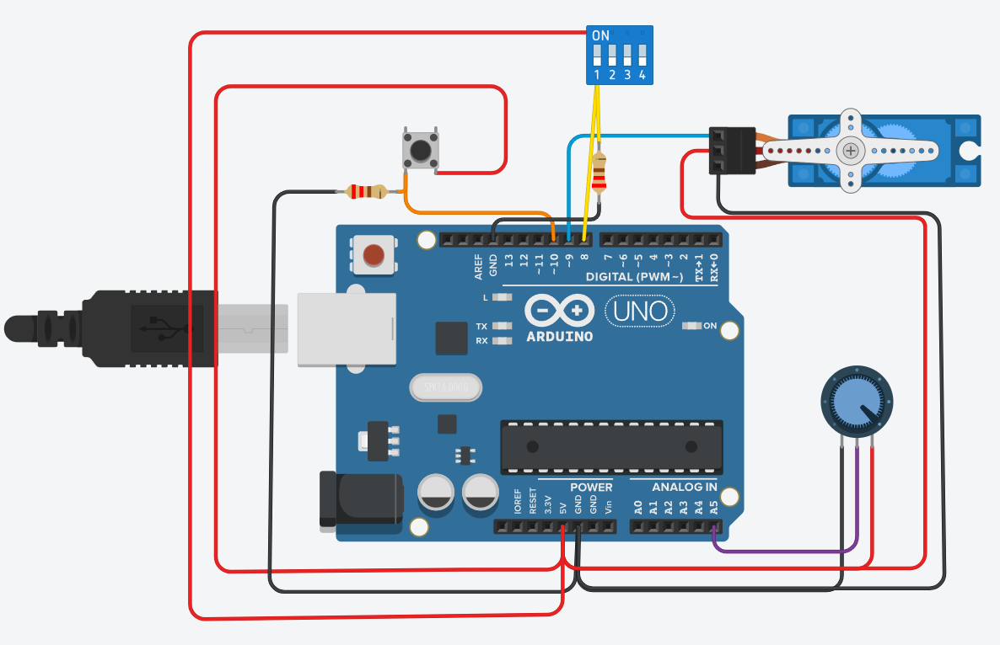

<h1 align="center">Servo con Memoria</h1>

Este proyecto es el resultado final de la materia de Organización Computacional.

<h1 align="center">Tecnologías Utilizadas</h1>

  
  

<h1 align="center">Detalles del Proyecto</h1>

Este proyecto consiste en guardar el recorrido de un servomotor en memoria eeprom (interna y/o externa), para después reproducirlo desde la misma. Siendo el armado físico la entrega final. 

<h1 align="center">Características Destacadas</h1>
<ul>
  <li><b>Movimiento:</b> El circuito debe permitir que la posición del servomotor sea definida de acuerdo al uso de un potenciómetro.</li>
  <li><b>Trayectoria:</b> El circuito debe almacenar la posición que tuvo el servomotor y el tiempo que duró para poder replicarlo al reproducir la grabación.</li>
</ul>

<h1 align="center">Interfaz</h1>

  

